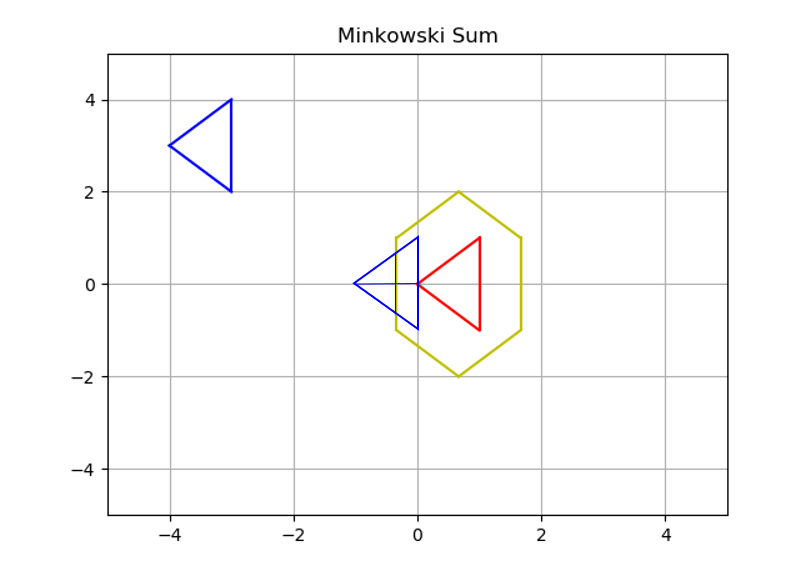

[](https://www.udacity.com/robotics)

# RoboND-MinkowskiSum
Inflate any obstacle and generate its configuration space using the Minkowski Sum.

### Example
Generating the configuration space of the blue Robot and red Obstacle


### Compiling
```sh
$ cd <repo_root>
$ mkdir build && cd build
$ cmake ..
$ make
```

### Running
```sh
$ cd <repo_root>/bin
$ ./minkowski_sum
```

### Generated Configuration Space
This program will first translate the blue robot position to the red obstacle, generate the green configuration space of the blue robot and red obstacle, and translate it to the red obstacle position as follows:


### Visualization of translating the structuring element's centroid along the boundary of the configuration space



### Reflections

- Minkowski sum is given by the following expression

    

    and is implemented as the following in `minkowski_sum.cpp`

    ```cpp
    vector<vector<double> > minkowski_sum(vector<vector<double> > A, vector<vector<double> > B)
    {
        vector<vector<double> > C;
        for (int i = 0; i < A.size(); i++) {
            for (int j = 0; j < B.size(); j++) {
                // Compute the current sum
                vector<double> Ci = { A[i][0] + B[j][0], A[i][1] + B[j][1] };
                // Push it to the C vector
                C.push_back(Ci);
            }
        }
        C = delete_duplicate(C);
        return C;
    }
    ```

- Another interpretation is when we move the transposed version of the structuring element, i.e. A, around in the plane. Whenever the translated transposed structuring element and the target region, i.e. B, have at least one point in common, we copy the translated reference point into the output.

- However, in the context of configuration space computation, we wish to have the effect of translating a non-transposed structuring element over the target region B. Thus, prior to executing the the Minkowski sum, a region transpose operation is executed to the structuring element A.

- Region A or B can be considered as the structuring element interchangably. In the implementation in `minkowski_sum.cpp`, we treat region A, i.e. the robot, as the structuring element.